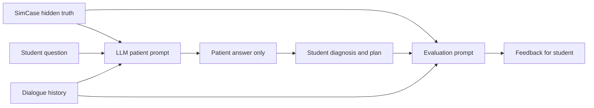

# AI Handoff: MedTech Clinical AI Platform

Last updated: 2026-07-22 (Gemini-related sections corrected — see inline "Correction" notes; Gemini was removed from the codebase in commit `381376f` and is no longer accurate anywhere it's mentioned as "current")

This file is for another AI/engineer who needs to understand the project quickly without reading the whole chat history.

## Project Goal

The product is a clinical AI MVP for a hackathon. It has three main ideas:

1. **Clinical RAG assistant**
   - Doctor enters symptoms, anamnesis, exam findings, and labs.
   - RAG searches official Kazakhstan clinical protocols.
   - LLM generates differential diagnoses, supporting findings, missing information, and follow-up questions.

2. **Student simulator**
   - Medical student talks to an AI patient.
   - The patient has hidden context and should answer like a real patient without revealing the diagnosis.
   - Student chooses diagnosis and management plan.
   - AI gives feedback.

3. **Rural urgent advice**
   - Nurse/doctor in rural area asks what to do.
   - Assistant must clearly state that the final decision belongs to the doctor/medical worker.
   - For emergency cases, do not delay care: ABC, vitals, ECG if chest pain, urgent referral/evacuation.

## Production

Frontend production URL:

https://medtech-ai-rag.vercel.app/ru/ai-assistant

Main GitHub repo:

https://github.com/Damenzzzz/MedTech

Current active branch used by Codex:

`codex/gpt55-rag`

Backup branch created before risky demo changes:

`codex/backup-pre-demo-2026-07-20`

## Important Architecture

There are two parts:

1. **Next.js app** in this repository
   - UI for RAG, urgent advice, simulator, STT.
   - API routes proxy to RAG backend and call LLM providers.

2. **Python RAG backend** in local workspace
   - Path on original machine:
     `/Users/nurdauletaldibek/Documents/med_hackaton/askhat_rag`
   - Served locally with Uvicorn on `127.0.0.1:8080`.
   - Exposed to Vercel through Cloudflare Tunnel.

## Key Frontend Files

### UI

`src/components/ai/clinical-ai-workspace.tsx`

Contains the main AI assistant UI:

- RAG tab
- Urgent advice tab
- Simulator tab
- STT tab

Important behavior:

- RAG tab calls `/api/clinical/diagnose/jobs`.
- It expects async job behavior:
  - start job
  - poll job status
  - show completed result

### RAG API Routes

`src/app/api/clinical/diagnose/jobs/route.ts`

Starts a RAG job by proxying to:

`RAG_SERVICE_URL/api/diagnose-jobs`

`src/app/api/clinical/diagnose/jobs/[jobId]/route.ts`

Polls job status from:

`RAG_SERVICE_URL/api/diagnose-jobs/{jobId}`

`src/app/api/clinical/diagnose/route.ts`

Synchronous/legacy diagnose route. It first tries async job internally, then direct RAG, then LLM fallback.

### Urgent Advice

`src/app/api/clinical/advice/route.ts`

This is the "what should we do right now?" feature for rural/under-resourced settings.

Product idea:

- A nurse, general doctor, feldsher, or rural medical worker may not have a narrow specialist nearby.
- Example: a patient arrives in a village clinic with chest pain, but there is no cardiologist on site.
- The assistant should help the clinician decide immediate safe actions while waiting for ambulance/specialist/transfer.
- It is **not** meant to replace the doctor.
- It is **not** meant to give a final diagnosis.
- It is **not** meant to give a definitive specialist treatment plan.
- It should give a practical bridge plan: what to assess, what to monitor, what red flags matter, how urgently to route, what not to miss, and what to prepare before professional help arrives.

Required safety wording:

- Final clinical decision belongs to the doctor/medical worker on site.
- AI is only an assistant.
- If the patient is unstable, do not wait for long RAG: start ABC/vitals/monitoring/urgent evacuation according to local emergency process.
- Use official protocol/RAG for deeper action guidance when time allows.

Expected output style for this feature:

- Clear immediate actions.
- Short explanation why each action matters.
- What to ask/check next.
- Red flags that require urgent escalation.
- What not to do.
- RAG/protocol sources when available.

For rural cardiology example, the assistant should think like:

- Chest pain can be time-sensitive.
- Do not promise a final diagnosis.
- Recommend immediate vital signs, ABC assessment, ECG if available, SpO2, BP, pulse, consciousness, pain onset/time, radiation, sweating, dyspnea, risk factors.
- Prepare transfer/ambulance if red flags are present.
- Avoid exact dosing or risky medication instructions unless protocol-backed and clinician can verify contraindications.
- Make the plan useful until cardiologist/emergency team arrives.

Important logic:

- `mode: "chat"` gives fast chat.
- `mode: "action"` does deeper action plan.
- Emergency fast chat has a guard:
  - No medication doses in quick emergency reply.
  - It tells user to do ABC/vitals/ECG/referral and use "Дать действия" for protocol-level plan.

Runtime behavior:

- Chat mode should be fast and should not call slow RAG for every small question.
- Action mode may use RAG when the LLM judges that protocol guidance is needed.
- User explicitly wanted the LLM to decide whether RAG is necessary:
  - if the question is simple and low-risk, answer directly;
  - if the case is risky or protocol-sensitive, use RAG or recommend pressing "Дать действия";
  - if the user presses "Дать действия", produce practical actions and use RAG when needed.
- RAG can take 2-3 minutes, so avoid blocking routine chat unless needed.

Important UX:

- This mode should feel like a clinical support chat, not a diagnosis page.
- Button text currently used: "Дать действия".
- The user wants this feature because rural clinics may need help before the right specialist arrives or while patient transfer is being arranged.
- The assistant should be decisive enough to be useful, but conservative enough to avoid unsafe over-treatment.

### Simulator

The simulator has two related implementations. Do not confuse them.

#### AI Assistant Simulator Tab

Main demo simulator used on:

`https://medtech-ai-rag.vercel.app/ru/ai-assistant`

Main UI and case data:

`src/components/ai/clinical-ai-workspace.tsx`

Important symbols:

- `type SimCase`
- `const SIM_CASES`
- `function SimulatorPanel()`

This is the simulator the user has been testing most recently.

Core idea:

- Every simulation scenario has a hidden clinical truth.
- Under the hood, an LLM plays the patient.
- The LLM receives:
  - scenario title
  - public brief visible to student
  - hidden patient context
  - correct diagnosis
  - expected symptoms/key findings
  - expected diagnoses
  - distractor diagnoses
  - expected management/treatment plan
  - unsafe plan options
  - current dialogue history
- The student only sees the public brief and the chat.
- The LLM must answer as the patient, not as an assistant.
- The patient must not reveal the diagnosis, ICD code, protocol, scoring rubric, or treatment plan.
- The patient should reveal symptoms only when the doctor/student asks relevant questions.

Current scenario shape:

```ts
type SimCase = {
  id: string;
  title: string;
  level: 'Базовый' | 'Средний' | 'Сложный';
  specialty: string;
  opening: string;
  publicBrief: string;
  hiddenContext: string;
  diagnosis: string;
  keyFindings: string[];
  expectedQuestions: string[];
  expectedDiagnoses: string[];
  distractorDiagnoses: string[];
  expectedPlan: string[];
  unsafePlan: string[];
};
```

The user specifically wants:

- At least 10-15 good scenarios.
- Start with basic cases, later cases should be harder.
- Scenarios should cover different specialties and not all feel the same.
- Student must be able to ask any free-text question.
- LLM patient must have enough hidden context to answer natural follow-up questions.
- Diagnosis choices should be broad with distractors so student can make mistakes.
- Treatment/management choices should also be broad, with at least 5 options and realistic wrong options.
- Student should be able to add their own diagnosis/plan option if the UI supports it later.
- Evaluation should compare student questions, diagnosis, and treatment against hidden ground truth.

Current simulator API used by this tab:

`src/app/api/simulator/respond/route.ts`

This route no longer calls `src/lib/llm.ts` directly. It resolves `getLlmProvider()` and dispatches to `LlmPatientEngine` (which calls `callClinicalJson()` from `src/lib/ai/text-llm.server.ts`) or `MockPatientEngine`. There is no Gemini step — see the corrected "LLM Provider Wrapper" section below (fixed in commit `381376f Fix simulator LLM fallback and main build`, after this doc's Gemini-era sections were written).

Important prompt behavior in this route:

- "Ты медицинский симулятор."
- "Твоя единственная роль: играть пациента."
- Answer in first person.
- Do not reveal diagnosis, ICD, protocol, criteria, or plan.
- Do not dump all hidden context at once.
- If the question is closed, answer shortly.
- If the question is open, answer 1-3 sentences.

`src/app/api/simulator/evaluate/route.ts`

This route evaluates the student.

It receives:

- `caseContext`
- `publicBrief`
- `hiddenContext`
- dialogue
- selected diagnoses
- selected treatment/management plan

It asks the LLM to return short Russian feedback:

1. what questions were good
2. what questions/symptoms/red flags were missed
3. whether diagnosis was correct
4. whether treatment/routing was correct
5. dangerous mistakes

It has a local fallback evaluator if the LLM call fails.

#### Older Training Simulator

There is also an older patient training flow:

- `src/app/[locale]/patients/page.tsx`
- `src/app/[locale]/training/[caseId]/page.tsx`
- `src/components/training/training-workspace.tsx`
- `src/data/cases.server.ts`
- `src/app/api/session/respond/route.ts`
- `src/engines/llm-patient-engine.server.ts`
- `src/engines/mock-patient-engine.server.ts`

This flow uses structured `MedicalCase` data from `src/data/cases.server.ts`.

Important:

- `src/data/cases.server.ts` has richer structured cases with:
  - patient demographics
  - localized complaint
  - urgency/difficulty
  - vitals
  - hidden facts
  - examinations
  - investigations
  - differential diagnoses
  - correct diagnosis
  - management plan
  - expected actions
  - dangerous actions
  - scoring rubric
- **Correction:** `LlmPatientEngine` no longer calls OpenAI directly — it calls `callClinicalJson()` from `src/lib/ai/text-llm.server.ts` (alem/mock only), same as everywhere else. Both `/api/session/respond` (older training flow) and `/api/simulator/respond` (AI assistant tab) now resolve `getLlmProvider()` and dispatch to the same `LlmPatientEngine`/`MockPatientEngine` pair, so they no longer differ in provider behavior.
- If `LLM_PROVIDER=mock` (or the alem call throws), both routes fall back to `MockPatientEngine`, which is why simulator answers can feel less intelligent — not an OpenAI-quota issue.

Recommended future cleanup:

- Unify both simulator paths on the same LLM wrapper.
- Use `src/data/cases.server.ts` as the source of truth for cases.
- Generate `SIM_CASES` from structured case data, or move `SIM_CASES` out of the component into a server/shared data file.
- Keep the role-play prompt strict: patient role only, no diagnosis disclosure.
- Keep local fallback for demo safety, but make it obvious when LLM fallback is used.

#### Simulator Runtime Flow

Expected student experience:

1. Student chooses a case.
2. Student sees only a short public brief, for example: "34-week pregnancy, severe headache and edema."
3. The system keeps hidden case context under the hood.
4. Student asks any question in free text.
5. Frontend sends the full case context and dialogue history to `/api/simulator/respond`.
6. LLM answers as the patient only.
7. Student continues history taking, then chooses:
   - differential diagnoses
   - main diagnosis
   - investigations
   - management/treatment options
8. `/api/simulator/evaluate` compares student decisions with hidden truth and returns feedback.

The hidden context is not a "nice-to-have"; it is the core of the simulator. The LLM must know the diagnosis and symptoms internally so it can imitate a consistent patient, but the student must not see that hidden truth until feedback.

Useful mental model:



#### Simulator Prompt Contract

When improving the simulator, preserve these rules:

- Patient LLM is not a doctor assistant.
- Patient LLM should not say "you may have myocardial infarction" or "this is preeclampsia."
- Patient LLM should answer like a real person with that disease would answer.
- Patient LLM should be consistent across turns.
- If asked about a symptom present in hidden context, reveal it naturally.
- If asked about a symptom absent in hidden context, deny it or say it is not noticed.
- If asked a vague question, ask for clarification as the patient.
- If asked an impossible medical/protocol question, answer from patient knowledge, not clinician knowledge.
- Do not reveal scoring rubric, expectedPlan, unsafePlan, or expectedDiagnoses.

Good patient answer:

`Боль началась около сорока минут назад, давит за грудиной и отдаёт в левую руку. Мне страшно, я вспотел.`

Bad patient answer:

`Это похоже на I20.0 нестабильную стенокардию, нужно ЭКГ и тропонин.`

#### Simulator Evaluation Contract

Evaluation should be strict but educational.

It should check:

- Did the student ask the key history questions?
- Did the student identify red flags?
- Did the student choose the right diagnosis or at least a safe differential?
- Did the student choose relevant investigations?
- Did the student choose appropriate management/treatment?
- Did the student make unsafe choices?
- Did the student communicate clearly?

For hard cases, feedback should explain why the correct diagnosis fits and why distractors are less likely. It should not only say "wrong"; it should teach.

Current UI has broad diagnosis and treatment options assembled from:

- `scenario.expectedDiagnoses`
- `scenario.distractorDiagnoses`
- several global distractors
- `scenario.expectedPlan`
- `scenario.unsafePlan`
- several global generic plan options

User wants this to remain broad so the student has room to make mistakes.

#### Simulator Known Weak Points

- The AI assistant simulator cases currently live inside `clinical-ai-workspace.tsx`; this is convenient for demo but not ideal long-term.
- The older training flow and the AI assistant simulator are separate; behavior can differ.
- No route uses OpenAI for text anymore (see corrected notes above); "degraded" behavior now means `LLM_PROVIDER=mock` or an Alem call failing, not an OpenAI-quota issue.
- Alem is weaker than GPT for natural patient role-play, so patient answers can feel less smart than they would with GPT — Gemini is no longer part of this app and isn't a lever to pull here.
- The simulator currently does not deeply use RAG for every patient answer. That is okay: role-play should be fast. RAG is more important for protocol-backed clinical assistant/advice and for future evidence-backed evaluation.
- If RAG is added to simulator evaluation later, use it selectively. Do not make every chat question wait 2-3 minutes.

Best next simulator improvement:

1. Move case definitions into a dedicated data file.
2. Ensure 10-15 polished cases across cardiology, pregnancy/emergency, pulmonology, endocrinology, gastroenterology, infection/sepsis, neurology.
3. Give each case:
   - public brief
   - hidden patient backstory
   - correct diagnosis
   - key symptoms
   - expected questions
   - differential options
   - treatment options
   - unsafe options
   - feedback rubric
4. Make all patient responses go through shared `callClinicalText()`.
5. Keep a visible warning/fallback if the LLM provider is down.

### LLM Provider Wrapper

**Correction (see git history below for why this section changed):** Gemini was briefly wired in as primary (`65e03ec Use Gemini before Alem for LLM calls`), but commit `381376f Fix simulator LLM fallback and main build` removed it. As of now there is no Gemini (or OpenAI) code path for text generation anywhere in the app — this matches the policy already stated in `README.md` and `.env.example` (`LLM_PROVIDER: alem | mock` only; OpenAI/Gemini strictly prohibited for text).

The canonical entry point is `src/lib/ai/text-llm.server.ts`:

- `callClinicalText(prompt, options?)` — plain text response
- `callClinicalJson<T>(prompt, options?)` — structured JSON response
- Both switch on `getLlmProvider()` (from `src/lib/ai/provider-config.server.ts`, `z.enum(['alem', 'mock'])`) with an exhaustive `never` check, so a third provider can't silently slip in without a compile error.

`src/lib/llm.ts` still exists but is now only a deprecated re-export shim over the file above, kept for backward compatibility. **Import from `@/lib/ai/text-llm.server` directly for any new code** — do not add new imports of `src/lib/llm.ts`.

### STT

`src/app/api/transcribe/route.ts`

Still uses OpenAI STT. User said not to touch STT until they buy OpenAI credits.

Known current situation:

- OpenAI key quota was exhausted.
- STT endpoint will fail until OpenAI billing/quota is fixed.
- User mentioned possible Hugging Face Whisper API later, but no endpoint/request/response format has been provided yet.

## Environment Variables

**Correction:** `GEMINI_API_KEY`/`GEMINI_MODEL`/`GEMINI_BASE_URL` are listed below as they appeared when this doc was written, but nothing in `src/` reads those env vars anymore (grep confirms zero matches) — Vercel may still have `GEMINI_API_KEY` set, but it's inert. Treat this list as historical; the real, current set is in `.env.example`.

Vercel Production had (as of writing):

- `RAG_SERVICE_URL`
- `OPENAI_API_KEY`
- `ALEM_API_KEY`
- `GEMINI_API_KEY` (no longer read by any code)

Expected meanings (current):

- `RAG_SERVICE_URL`: public tunnel URL to local Python RAG backend.
- `ALEM_API_KEY`: the only text LLM provider besides `mock`.
- `OPENAI_API_KEY`: only needed for STT (`/api/transcribe`), never for text generation.

Optional model/env knobs:

- `ALEM_CHAT_MODEL`, default `alemllm`
- `ALEM_BASE_URL`, default `https://llm.alem.ai/v1`

## RAG Backend Data

The active RAG corpus is **not** `data/index.json`.

Python backend loads corpus from:

`data/corpus/merged_protocols_structured_dedup.jsonl`

Fallback corpus:

`data/corpus/merged_protocols.jsonl`

The `.jsonl` corpus contains one JSON object per line. Each protocol has fields like:

- `protocol_id`
- `source_file`
- `title`
- `icd_codes`
- `text`

Known issue:

- Some titles are dirty. Example: title may be `"Одобрен"` while `source_file` is `HELLP-СИНДРОМ.pdf`.
- For a custom RAG from scratch, clean title from `source_file` if title is bad.

Search indexes are built from the corpus and stored in:

`data/indexes/`

Important index files:

- `bm25.pkl`
- `faiss.index`
- `chunks.pkl`
- `metadata.json`

Current metadata seen before:

- around 1207 protocols
- around 18115 chunks

## RAG Backend Code

Original local path:

`/Users/nurdauletaldibek/Documents/med_hackaton/askhat_rag`

Important files:

- `server.py`
  - FastAPI server
  - loads protocols
  - starts async diagnose jobs
  - has `/health`
  - has `/api/diagnose-jobs`
  - has `/api/diagnose-jobs/{job_id}`

- `data_loader.py`
  - loads JSONL protocols

- `indexer.py`
  - chunks protocols
  - builds BM25 + FAISS

- `retriever.py`
  - hybrid retrieval logic
  - BM25 + FAISS + ICD lookup + reranking

- `generator.py`
  - final diagnosis generation prompt
  - faithfulness rules
  - asks follow-up questions

- `postprocessor.py`
  - parses/normalizes LLM diagnosis output

## Hard Parts / Things That Broke

### 1. Localtunnel was unstable

Old public tunnel sometimes returned 502 for long RAG calls.

Fix:

- Switched to Cloudflare Tunnel.
- Also changed frontend to use async job polling instead of one long request.

Important: Cloudflare quick tunnel is still not a true production backend. For final product, deploy Python RAG to real hosting:

- Railway
- Render
- Fly.io
- VPS
- Cloud Run

### 2. Bad demo-safe RAG shortcut was added and then reverted

A commit added instant cached/demo RAG fallback for chest pain and preeclampsia so demo would not fail if tunnel died.

Problem:

- It made user feel real RAG was not analyzing.
- It returned instant top diagnoses instead of live retrieval.

Fix:

- Reverted in commit:
  `252c310 Revert "Add presentation-safe RAG guardrails"`

Current behavior:

- `/api/clinical/diagnose/jobs` should start live RAG job and return `job_id` + `running`.
- It should not instantly return cached demo result.

### 3. Alem LLM quality is weaker than GPT

OpenAI quota ran out, so main LLM was moved to Alem. Gemini was briefly tried as primary (`65e03ec`) but was removed in `381376f` to comply with the README/`.env.example` policy (no OpenAI/Gemini for text). Alem (or `mock` in CI/tests) is now the only text LLM path — see the corrected "LLM Provider Wrapper" section above.

Observed:

- Alem can follow basic role-play.
- Alem is weaker for strict clinical JSON and nuanced medical guardrails.
- Simulator may feel worse than GPT.

### 4. ~~Gemini key is valid but depleted~~ (obsolete — Gemini removed)

This issue no longer applies: Gemini isn't wired into the app at all anymore (no code reads `GEMINI_API_KEY`/`GEMINI_MODEL`/`GEMINI_BASE_URL`). Left here only so the numbering in this doc doesn't shift and confuse cross-references. If Alem quality is still a concern, the fix is to improve Alem prompts/guardrails or add a new provider properly (updating `LlmProviderSchema` in `provider-config.server.ts`, `.env.example`, and README together) — not to reintroduce Gemini informally.

### 5. STT is currently not reliable

OpenAI STT requires OpenAI quota.

User said:

- do not touch STT for now
- tomorrow they may buy OpenAI tokens

Potential future option:

- User mentioned Hugging Face model `antony66/whisper-large-v3-russian`.
- It may be good for Russian STT but needs hosted inference/GPU and does not solve speaker diarization by itself.
- Need actual API endpoint and response format before implementing.

### 6. Faithfulness matters

Earlier model hallucinated protocol criteria as patient facts. Example:

- Protocol says proteinuria should be checked.
- Model incorrectly wrote patient has proteinuria.

Important rule:

- Patient facts must only come from input text.
- Protocol criteria not present in patient text should go to:
  - `missing_findings`
  - `recommended_checks`
  - `protocol_criteria`

Not to:

- `supporting_findings`
- `summary`
- `patient_findings`

## Current Git State

Most recent important commits:

- `65e03ec Use Gemini before Alem for LLM calls`
- `252c310 Revert "Add presentation-safe RAG guardrails"`
- `4573062 Guard fast advice emergency replies`
- `87ffefc Use Alem LLM for clinical flows`
- `70e725f Add presentation-safe RAG guardrails` (bad shortcut; reverted)

## How To Start Local Python RAG Backend

From original workspace:

```bash
cd /Users/nurdauletaldibek/Documents/med_hackaton
.venv/bin/uvicorn askhat_rag.server:app --host 127.0.0.1 --port 8080
```

Check:

```bash
curl http://127.0.0.1:8080/health
```

Expected:

```json
{"status":"ok","protocols":1207}
```

## How To Expose RAG Backend

Cloudflare quick tunnel:

```bash
cloudflared tunnel --url http://127.0.0.1:8080
```

Then set Vercel env:

```bash
vercel env rm RAG_SERVICE_URL production --yes
printf '%s' 'https://YOUR-TUNNEL.trycloudflare.com' | vercel env add RAG_SERVICE_URL production
vercel --prod --yes
```

## How To Verify Live RAG Is Working

Call production:

```bash
curl -s -X POST https://medtech-ai-rag.vercel.app/api/clinical/diagnose/jobs \
  -H 'content-type: application/json' \
  --data '{"symptoms":"Пациент 58 лет, давящая боль за грудиной 40 минут, холодный пот, одышка, иррадиация в левую руку."}'
```

Healthy live behavior:

```json
{
  "job_id": "...",
  "status": "running"
}
```

Then poll:

```bash
curl -s https://medtech-ai-rag.vercel.app/api/clinical/diagnose/jobs/JOB_ID
```

Completed behavior:

```json
{
  "status": "completed",
  "result": {
    "diagnoses": [...],
    "sources": [...]
  }
}
```

## User Is Also Practicing Writing RAG From Scratch

They started manual RAG practice:

1. load JSONL corpus
2. clean title
3. split text
4. embed chunks
5. store in Chroma
6. retrieve

They used ParentDocumentRetriever and Chroma.

Known issue:

`batch_size=50` parent docs produced `6072` child chunks, but Chroma max batch was `5461`.

Advice:

- lower parent batch size to 10 or 20
- use persistent Chroma:

```python
vectorstore = Chroma(
    collection_name="kz_protocols",
    embedding_function=embedding,
    persist_directory="./chroma_db",
)
```

Important:

- `InMemoryStore()` loses parent docs after restart.
- For practice it is okay.
- For reusable RAG use persistent docstore or save parent docs separately.

## Recommended Next Steps

1. Keep live RAG behavior; do not re-add instant cached diagnosis shortcut unless behind a visible toggle.
2. ~~Fix/renew Gemini credits if Gemini should really be primary.~~ Superseded — Gemini was intentionally removed (`381376f`) to comply with the alem/mock-only policy in README/`.env.example`. Don't reintroduce it without updating that policy first.
3. Use GPT again for simulator and clinical final generation if OpenAI credits are restored and the no-OpenAI-for-text policy is deliberately revisited; quality was better.
4. Deploy Python RAG backend to real hosting instead of tunnel.
5. Add proper STT only after API/quota is available.
6. Improve title cleaning and table-aware extraction for custom RAG practice.
